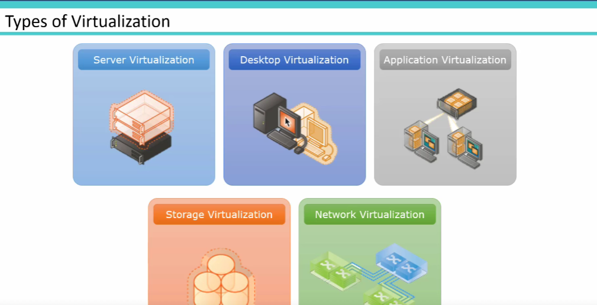

# BASICS
## Virtualization 
-> It decouples hardware from OS.

Enabler for Virtualization- Decreasing cost of hardware.

Types of virtualization-

Challenges -
1. Noisy neighbour
2. Management Overhead
3. Cost- Licensing cost
4. App needing bare metal access